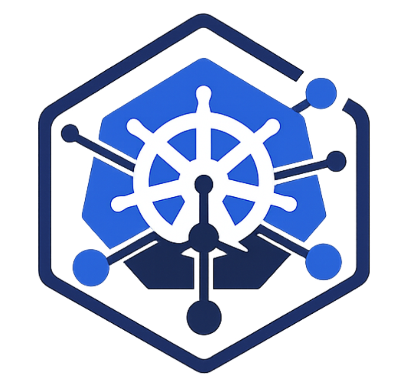
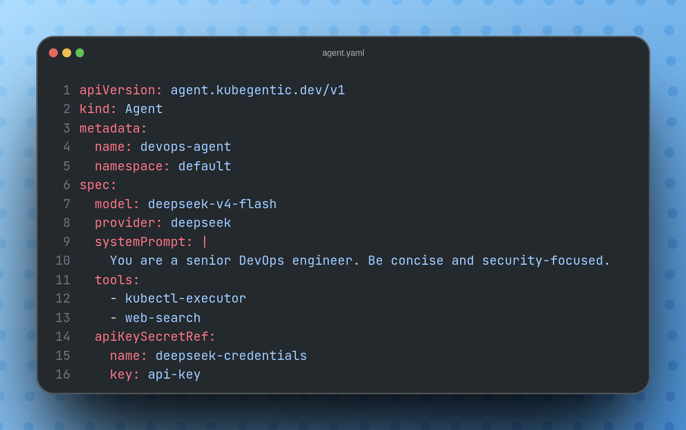

<div align="center">



# Kubegentic

**Kubernetes-native AI Agent Runtime Platform**

Treat AI agents as first-class Kubernetes workloads -- declarative, self-healing, observable, and scalable.

[](https://opensource.org/licenses/Apache-2.0)
[](https://golang.org/)
[](CONTRIBUTING.md)

</div>

Kubegentic lets you define and manage AI agents and their tools as Kubernetes custom resources. The operator watches Agent and Tool CRDs and reconciles the desired state — creating Deployments, injecting tool endpoints, and managing RBAC automatically.

> **Status:** Early development. Agent and Tool CRD reconciliation is implemented. Python agent runtime and Helm chart are on the roadmap.

---

## Features

- **Declarative YAML** : Define agents and tools in standard Kubernetes manifests
- **Operator Pattern** : Self-healing reconciliation loop built with Kubebuilder
- **Tool CRD** : Sidecar-like tool services with automatic endpoint injection into agents
- **Autoscaling** : Event-driven scaling via KEDA and HPA
- **Observable** : OpenTelemetry traces, Prometheus metrics, structured logging

---

## Why Kubegentic?

Running AI agents in production today requires wiring together infrastructure, scaling, and monitoring manually. Kubegentic brings AI agents into the Kubernetes ecosystem so they behave like any other workload:

1. Declare your agent in YAML
2. The operator handles provisioning, networking, and RBAC
3. Platform tooling (Prometheus, Grafana, KEDA) works out of the box

---

## How It Works

### Agents

Define an agent in a manifest. Agents can reference **Tools** (sidecar services that provide capabilities like web search, code execution, etc.):



The operator resolves each referenced Tool, waits for it to be ready, and injects its endpoint as an environment variable (`TOOL_<NAME>_ENDPOINT`) into the agent's Deployment.

Apply it:

```bash
kubectl apply -f agent.yaml
kubectl get agents
```

### Tools

Tools are sidecar-like services that agents consume at runtime. Define one like this:

```yaml
apiVersion: agent.kubegentic.dev/v1
kind: Tool
metadata:
  name: kubectl-executor
  namespace: default
spec:
  image: kubegentic/tool-kubectl:latest
  port: 8080
  storage:
    size: 1Gi
    mountPath: /workspace
```

Apply it:

```bash
kubectl apply -f tool.yaml
kubectl get tools
```

The operator creates a Deployment and Service for the tool, and exposes the endpoint in `.status.endpoint` for agents to consume.

---

## Quickstart

### Prerequisites

- Go 1.21+
- Docker
- [Kind](https://kind.sigs.k8s.io/)
- kubectl

### Run it locally

```bash
# Clone and build
git clone https://github.com/ahmedharabi/kubegentic.git
cd kubegentic

make build

# Bootstrap a cluster and deploy
kind create cluster --name kubegentic
make install
make docker-build IMG=kubegentic/operator:latest
kind load docker-image kubegentic/operator:latest --name kubegentic
make deploy IMG=kubegentic/operator:latest

# Apply a sample agent
kubectl apply -f config/samples/agent_v1_agent.yaml
kubectl get agents
```

---

## Repository Structure

```
kubegentic/
├── api/v1/                  # CRD type definitions (Agent, Tool, + deepcopy)
│   ├── agent_types.go
│   ├── tool_types.go
│   └── zz_generated.deepcopy.go
├── cmd/main.go              # Controller manager entry point
├── config/                  # Kustomize manifests (CRD, RBAC, manager deployment)
│   ├── crd/
│   ├── rbac/
│   └── samples/
├── internal/controller/     # Reconciliation loop logic
│   ├── agent_controller.go
│   ├── tool_controller.go
│   └── tool_controller_test.go
├── test/                    # End-to-end tests
├── Dockerfile               # Container image
├── Makefile                 # Build, test, deploy targets
└── go.mod                   # Go module
```

---

## Contributing

Contributions are welcome.

```bash
git clone https://github.com/ahmedharabi/kubegentic.git
cd kubegentic
git checkout -b feat/your-feature

# Make your changes, then:
make test
make build
```

Before starting significant work, please open an issue to discuss your approach. This helps avoid duplicated effort and ensures alignment with the project direction.

See [CONTRIBUTING.md](./CONTRIBUTING.md) for detailed guidelines.

---

## License

Apache 2.0 -- see [LICENSE](./LICENSE).
